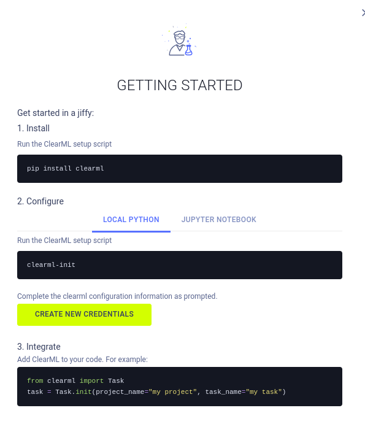

# NMAP
```bash
nmap -sC -sV -Pn -p- 10.10.11.19 -T5 
Starting Nmap 7.95 ( https://nmap.org ) at 2025-05-25 07:48 EDT
Nmap scan report for app.blurry.htb (10.10.11.19)
Host is up (0.047s latency).
Not shown: 65533 closed tcp ports (reset)
PORT   STATE SERVICE VERSION
22/tcp open  ssh     OpenSSH 8.4p1 Debian 5+deb11u3 (protocol 2.0)
| ssh-hostkey: 
|   3072 3e:21:d5:dc:2e:61:eb:8f:a6:3b:24:2a:b7:1c:05:d3 (RSA)
|   256 39:11:42:3f:0c:25:00:08:d7:2f:1b:51:e0:43:9d:85 (ECDSA)
|_  256 b0:6f:a0:0a:9e:df:b1:7a:49:78:86:b2:35:40:ec:95 (ED25519)
80/tcp open  http    nginx 1.18.0
|_http-server-header: nginx/1.18.0
|_http-title: ClearML
Service Info: OS: Linux; CPE: cpe:/o:linux:linux_kernel

Service detection performed. Please report any incorrect results at https://nmap.org/submit/ .
Nmap done: 1 IP address (1 host up) scanned in 36.90 seconds
```
Through NMAP we can see that there is `ClearML` running on the site.




After logging in and setting up our ClearML environment we can find in the recent experiments a `Review JSON Artifacts` task that automatically runs any uploaded artifact with the tag `review`.

# Foothold
In order to get user access to the machine we need to create an json artifact and upload it to the `ClearML` platform.

```bash
python3 malicious_agent.py
```

After waiting for a bit, it gets processed and we get our user shell back.
# Privilege escalation

```bash
jippity@blurry:~/.ssh$ sudo -l
Matching Defaults entries for jippity on blurry:
    env_reset, mail_badpass, secure_path=/usr/local/sbin\:/usr/local/bin\:/usr/sbin\:/usr/bin\:/sbin\:/bin

User jippity may run the following commands on blurry:
    (root) NOPASSWD: /usr/bin/evaluate_model /models/*.pth

```

We can use the evaluate_model as root without the need of a password.

The evaluate_model script need a PyTorch file as an input.

The script uses the fickling method to check if the unzipped serialized PyTorch file is `OVERTLY_MALICIOUS`, the issue here is that the are a lot more severities than the checked one.

We can use the `malicious_agent_root.py` to create a PyTorch reverse shell.

