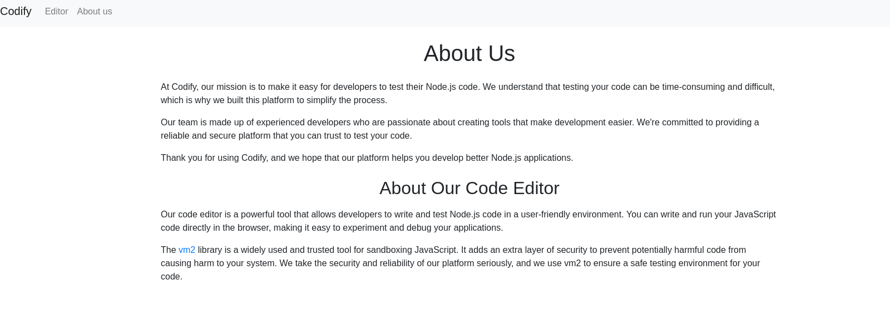
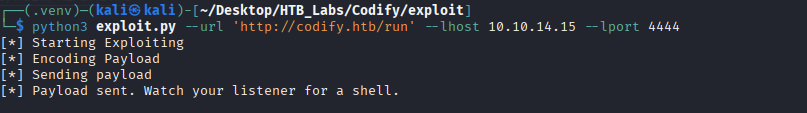
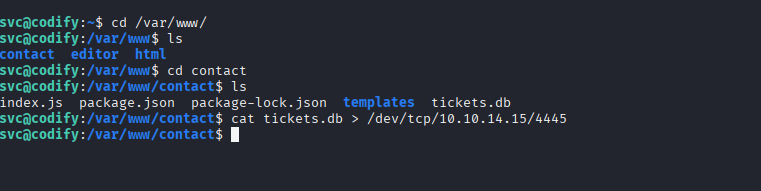
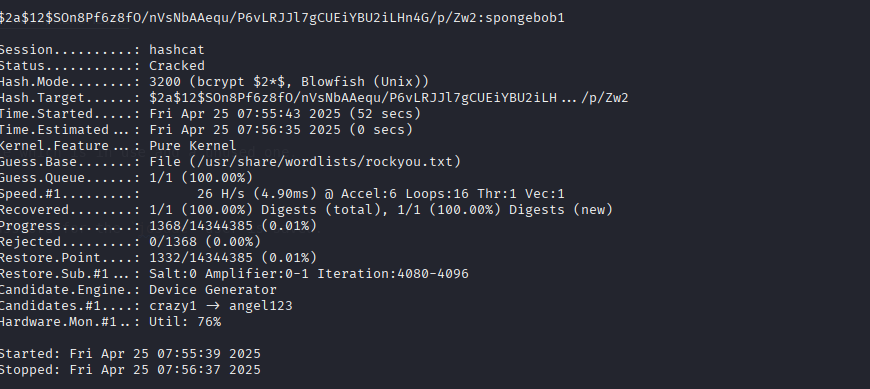
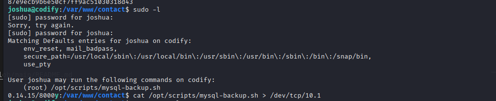
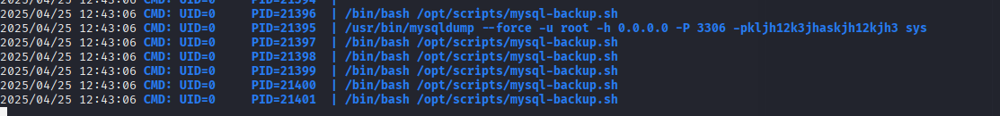

# Enumeration

## NMAP

```bash
nmap -sC -sV -Pn -p- 10.10.11.239 -T5
Starting Nmap 7.95 ( https://nmap.org ) at 2025-04-25 07:02 EDT
Nmap scan report for 10.10.11.239
Host is up (0.049s latency).
Not shown: 65532 closed tcp ports (reset)
PORT     STATE SERVICE VERSION
22/tcp   open  ssh     OpenSSH 8.9p1 Ubuntu 3ubuntu0.4 (Ubuntu Linux; protocol 2.0)
| ssh-hostkey: 
|   256 96:07:1c:c6:77:3e:07:a0:cc:6f:24:19:74:4d:57:0b (ECDSA)
|_  256 0b:a4:c0:cf:e2:3b:95:ae:f6:f5:df:7d:0c:88:d6:ce (ED25519)
80/tcp   open  http    Apache httpd 2.4.52
|_http-server-header: Apache/2.4.52 (Ubuntu)
|_http-title: Did not follow redirect to http://codify.htb/
3000/tcp open  http    Node.js Express framework
|_http-title: Codify
Service Info: Host: codify.htb; OS: Linux; CPE: cpe:/o:linux:linux_kernel

Service detection performed. Please report any incorrect results at https://nmap.org/submit/ .
Nmap done: 1 IP address (1 host up) scanned in 40.70 seconds
```

Looking around in the codify.htb site we come across the library which is used for sandboxing.



# Foothold

## Vulnerability Search

| Source  | Link                                                             |
| ------- | ---------------------------------------------------------------- |
| NIST    | https://nvd.nist.gov/vuln/detail/cve-2023-30547                  |
| Exploit | https://github.com/user0x1337/CVE-2023-30547/blob/main/README.md |



After using the exploit we get the reverse shell back.

Looking around in the `/var/www/` directory we found the site which is in use and a unused one.



In the unused site we find a database in which the hashed password for the `joshua` user is saved.

Cracking the password with hashcat returns us `spongebob1` as the password.

```bash
$ hashcat -a 0  -m 3200 codify_hash /usr/share/wordlists/rockyou.txt
```



## Lateral Movement



In the allowed mysql-backup.sh we can find 2 exploitable issues

1. The user input is on the right side of the check and is unquoted
2. The DB_PASS can be seen via the ps -ef command

To capture the password we will use pspy. In one terminal we start the pspy and in an other we start the mysql-backup.sh, as a password we will provide `*`.



So the root pass is `kljh12k3jhaskjh12kjh3`
